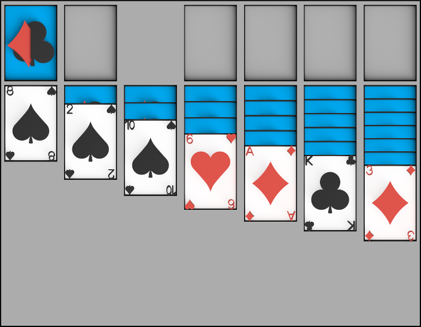

# Solitaire
Cross-platform Klondike card game. 
Application has been written in Qt Framework using C++ language. 
Content of project has been designed for Qt 5.

## Build instructions

* Clone the Solitaire game repository.
* Move into the `src` directory and run `qmake` utility to generate Makefile.
* Build the executable using `make` automation tool.
* Run Solitaire.
